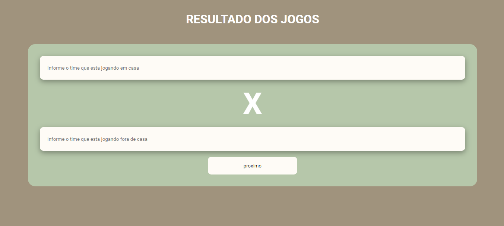

# Placar

 >Placar de jogos

decidi praticar um pouco, em Sala de aula foi passado alguns exercício de logica utilizando a linguagem de programação Python, eu decidi ir além e realizar as atividade na web. no link a Baixo você terá acesso a versão atual da Pagina!  

[Clique aqui para ascessar](https://martinsalan2003.github.io/Placar/)

## Tecnologias

- HTML
- CSS
- JAVASCRIPT
- GIT E GITHUB

## Contato
- Email: alanmartinsferreira59@gmail.com
- Linkedin: https://www.linkedin.com/in/alan-martins-ferreira-5a8a48233/

